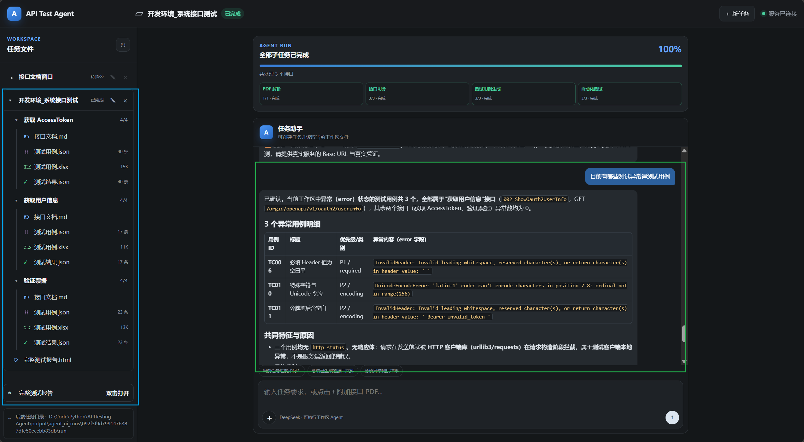

# API Testing Agent

## 项目简介

传统接口测试需要测试人员根据接口文档手动分析参数、设计测试用例并执行测试，存在效率低、人力成本高的问题。

APITestAgent 基于 LLM Agent 技术，实现：

- 接口文档自动解析
- 测试用例智能生成
- 自动化接口测试执行
- 测试结果智能分析

帮助测试团队降低重复工作成本，提高接口测试效率。



## Agent运行结果展示

左侧区域展示 **APITestAgent 执行任务后自动生成的测试产物**。Agent根据接口文档完成接口解析、测试用例生成以及自动化测试执行流程，并针对每个接口生成对应的结构化文件，包括：

- **接口文档 Markdown 文件（xxx.md）**：解析后的接口信息，包含接口描述、请求方式、参数定义等内容；
- **测试用例文件（xxx.json / xxx.xlsx）**：根据接口规范自动生成的测试场景，覆盖正常流程、参数边界、异常输入等测试类型；
- **测试结果文件（xxx.json）**：记录自动化测试执行过程及结果信息；
- **完整测试报告（HTML）**：汇总所有接口测试情况，包括测试统计、异常用例分析以及问题定位结果。

通过自动生成上述测试资产，实现从接口文档理解到测试结果输出的全流程自动化，减少人工编写和整理测试文档的工作量。

## 对话式 Agent 测试入口

绿色框选区域为 **APITestAgent 对话式测试入口**。用户无需编写复杂测试脚本，只需通过自然语言向 Agent 提出测试需求，例如指定测试接口、异常场景或测试目标，Agent即可自动理解需求并执行对应的接口测试任务。

该交互方式支持测试人员以对话形式驱动测试流程，实现 **“需求输入 → Agent规划 → 自动测试执行 → 结果分析”** 的智能化接口测试体验。


## Quick Start

### 1. Clone 项目

```bash
git clone https://github.com/clv52/APITestingAgent.git

cd APITestingAgent
```

### 2. 创建运行环境

```bash
conda create -n apitestagent python=3.10.0

conda activate apitestagent
```

### 3. 安装依赖

```bash
pip install -r requirements.txt
```

### 4. 启动项目

```bash
python ./api_test_web.py
```
